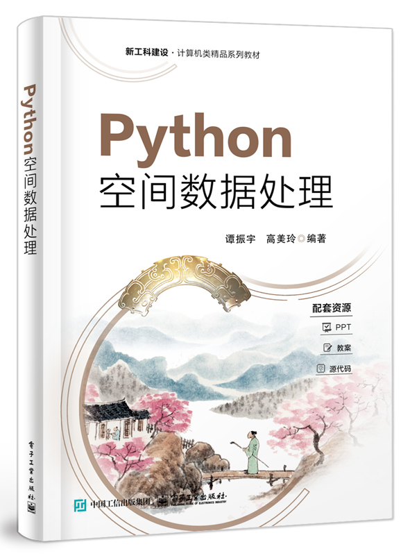
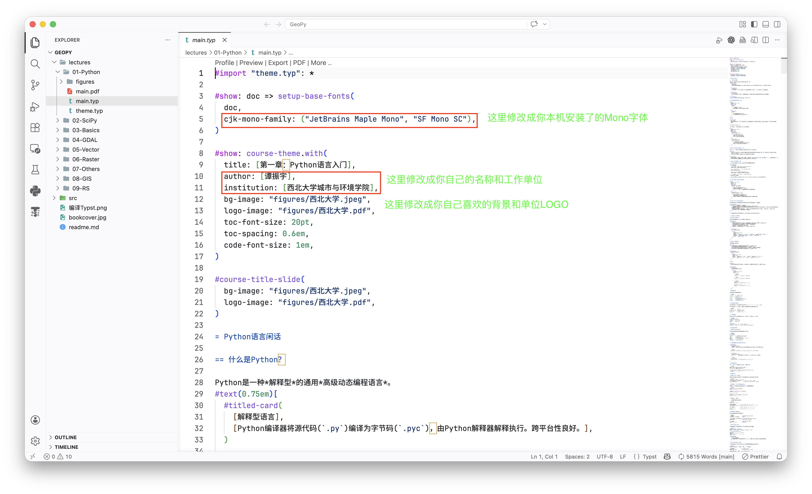
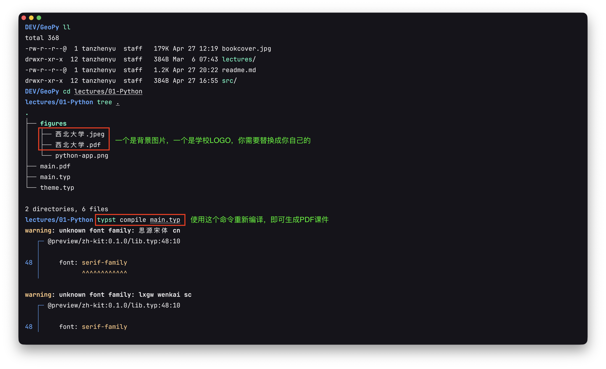

本仓库提供《Python空间数据处理》教材相关数据，代码和课件的共享，使用本教材的同学或老师可以免费下载使用。

# 书籍

# 数据

实验数据中存在一些示例遥感图像，数据量较大，所以在百度网盘共享。

链接地址：[通过网盘分享的知识：GeoPy](https://pan.baidu.com/s/5_cGh3ajWNUq-vzm-8BwvCg)

# 代码

书中案例代码在 `src`文件夹下，按照章节内容进行组织

# 课件

本书配套课件在 `lectures`文件夹下，按照章节内容进行组织。课件使用[`typst`](https://typst.app/)制作（课件会不定期更新和维护）。

`typst`提供了在线的编辑APP，当然用户也可以离线下载使用。

对于Windows用户，可以直接在[官网](https://typst.app/open-source/#download)下载 `typst`安装包安装，然后在系统 `PATH`环境变量中添加安装的 `typst`。

然后，在VSCode中安装Tinymist Typst插件，之后就可以在VSCode中修改和编译Typst文件了。

需要替换幻灯片课件背景和LOGO以及首页信息的老师，可以直接替换 `figures`文件夹中的背景图片和LOGO图片，然后在 `main.typ`文件中进行作者信息的修改，重新编译Typst文件即可，如下图所示。

