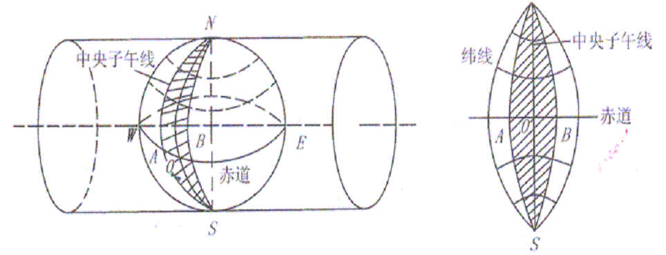

# 地图投影

作者：阿振

邮箱：tanzhenyugis@163.com

博客：<https://blog.csdn.net/theonegis/article/details/80089375>

修改时间：2018-04-29

声明：

- 本文为博主原创文章，转载请注明原文出处

- 图片来源于网络，如有侵权请私信删除

---

## 什么是地图投影

我们的地球是圆的，而我们的纸张是平面。为了将地球绘制在平面纸张上，我们需要将地球表面投影到平面上。地图投影的实质是建立空间地理坐标和平面直角坐标关系的过程。

进过投影，我们的地球在平面上可能是这个样子，也可能是那个样子，但是地图投影要尽可能减少实际地物在平面上的变形，尽可能真实地表现地物的位置及地物之间的相对位置。

## 地图投影分类

### 根据投影面和地球球面的位置关系

1. 投影面和地轴的关系

- 正轴投影（投影面的中心线与地轴一直）
- 斜轴投影（投影面的中心线与地轴斜交）
- 横轴投影（投影面的中心线与地轴垂直）

2. 投影面和地球面的关系

- 切投影 (投影面和地球球面相切)
- 割投影 (投影面和地球球面相割)

### 根据正轴投影时经纬网的形状

- 圆锥投影 （投影中纬线为同心圆圆弧，经线为圆的半经）

- 圆柱投影 （投影中纬线为一组平行直线，经线为垂直于纬线的另一组平行直线，且两相邻经线之间的距离相等）

- 方位投影 （投影中纬线为同心圆，经线为圆的半径，且经线间的夹角等于地球面上相应的经差）

  此外，还有伪圆锥投影，伪圆柱投影，伪方位投影，多圆锥投影等

  

### 根据投影的变形

- 等角投影 （地球表面无穷小图形投影后保持相似）
- 等面积投影 （地球表面图形在投影后面积保持不变）
- 任意投影

## 常用地图投影

1. 我国基本比例尺地形图（1:100万，1:50万，1:25万，1:10万，1:5万，1:2.5万，1:1万，1:5000）除1:100万以外均采用高斯-克吕格Gauss-Kruger投影（横轴等角切圆柱投影）为地理基础。

   

   通常其按经差6°或3°分为六度带或三度带。根据带号及其带内的平面直角坐标，即可确定在地球上的位置。

   

2. 1:100万地形图采用兰伯特Lambert投影（正轴等角割圆锥投影），其分幅原则与国际地理学会规定的全球统一使用的国际百万分之一地图投影保持一致。

3. 我国大部分省区图以及大多数这一比例尺的地图也多采用Lambert投影和同属于这一投影系统的Albers投影（正轴等面积割圆锥投影）。

4. UTM投影（Universal Transverse Mercator Projection）全称为“通用横轴墨卡托投影”，是横轴等角割圆柱投影（高斯-克吕格为横轴等角切圆柱投影）。UTM投影与高斯投影的主要区别在南北格网线的比例系数上。Landsat卫星影像使用该投影。

5. Google地图和百度地图使用的墨卡托投影（正轴等角圆柱投影），但是这种网络地图使用的墨卡托投影和常规的墨卡托投影稍微有一些区别：在网络地图中将地球抽象为球体而不是椭球体，这样的墨卡托投影称为Web Mercator投影。此外，墨卡托投影广泛用于航海图。