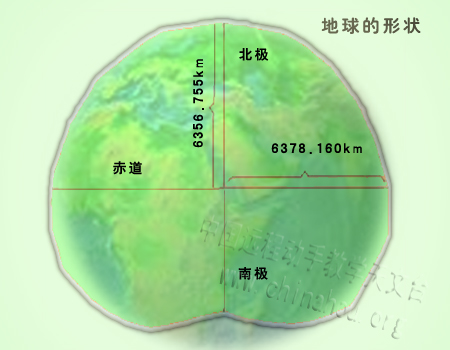
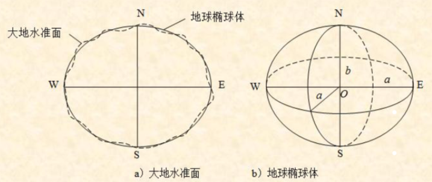

# 空间参考系统

作者：阿振

邮箱：tanzhenyugis@163.com

博客：<https://blog.csdn.net/theonegis/article/details/80089375>

修改时间：2018-04-28

声明：

- 本文为博主原创文章，转载请注明原文出处

- 图片来源于网络，如有侵权请私信删除

---

## 空间参考系统（分类）

在三维的地球上，我们为了描述一个物体的空间位置，定义了：

- 坐标参考系统 (X, Y)
- 高程参考系统 (Z)

不考虑高程，对于空间位置的描述我们有：

- 地理坐标系 （使用经纬度坐标表示）
- 投影坐标系  （使用平面直角坐标表示）

## 地球椭球体和大地基准面（如何建立空间参考系统）

地球像一个倒放着的大鸭梨，两极略扁，中间略大的不规则球体。

假想将静止的平均海水面，延伸到大陆内部，形成一个连续不断的，与地球比较接近的形状，其表面称之为大地水准面，由它包围的球体叫“大地体”。

大地水准面的特性：其表面处处和铅垂线正交

为了测量成果的计算和制图工作的需要，通常用地球椭球体来代替大地体。我们使用一个形状同地球相近，并能用数学方法来表达的旋转椭球体描述我们的地球。

建立了地球椭球体，即确定了地球的形状和大小。为了观测和制图的准确和方便，我们还需要确定椭球体与大地水准面的相对位置。

- 地心坐标系 （如果参考椭球体和大地体球心重合，例如WGS84，2000国家大地坐标系）
- 参心坐标系 （如果参考椭球体和大地体球心不重合，例如北京54坐标系，西安80坐标系）

总结一下：

确定一个空间参考系统需要：

- 确定地球椭球体参数
- 确定高程系统 （一个国家一般只有一个高程系统）
- 确定参考椭球和大地水准面的位置关系

## 我国常用的空间参考

我国家常用的空间参考系统：

- 1954年北京坐标系（北京54）：我国过去采用的大地坐标系，其原点在苏联西部的普尔科夫，采用克拉索夫斯基椭球模型
- 1980年国家坐标系（西安80）：1980年新测定位于陕西省的坐标原点，采用1975年国家椭球模型

高程系统

我国曾使用过黄海平均海水面，称“1956黄海高程系”。 现采用“1985年国家高程基准”，该系统是采用青岛验潮站1952年—1979年潮汐观测资料计算的平均海水面作为高程基准面。
